# 🏢 E-Canopy — Society Management System (Spring Boot + React)

A full-stack **Society Management System** built with **Spring Boot + React** featuring **Role-Based Access Control (RBAC)**, **Amenity Booking Workflow**, **Visitor Management**, **Complaints Helpdesk**, **Maintenance Billing + Razorpay Payments**, and **Email Notifications**.

---

## ⭐ Project Preview (Screenshots)

### 🌐 Landing Page
> Clean landing page for initial navigation.


---

### 🔐 Super Admin Panel
> Super Admin can manage societies, create secretaries, and control system-level configuration.

| Login | Dashboard |
|-----------|-----------|
|  |  |

| Create Secretary | Create Societies |
|-----------|-----------|
|  |  |

| Manage Existing Societies | Manage Societies |
|-----------|-----------|
| 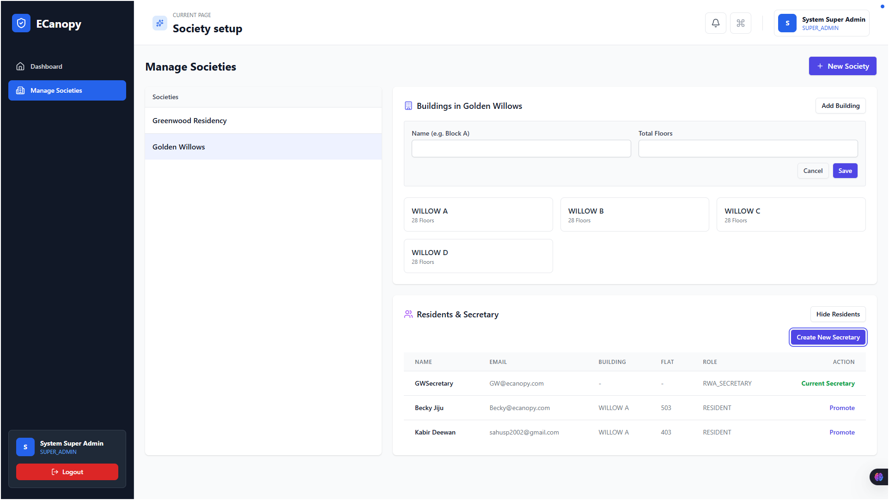 | 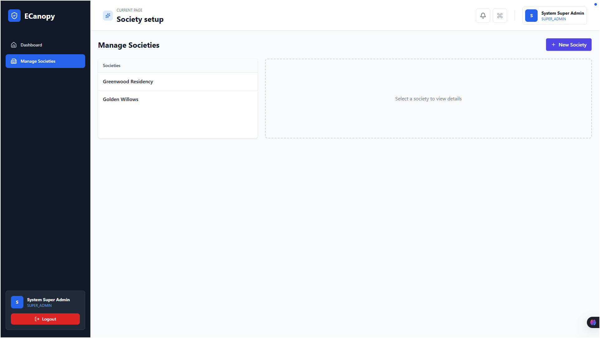 |

---

### 🏢 Secretary Panel
> Secretary manages amenities, residents, complaints, notices, and society-level operations.

| Login | Dashboard |
|-----------|-----------|
|  | 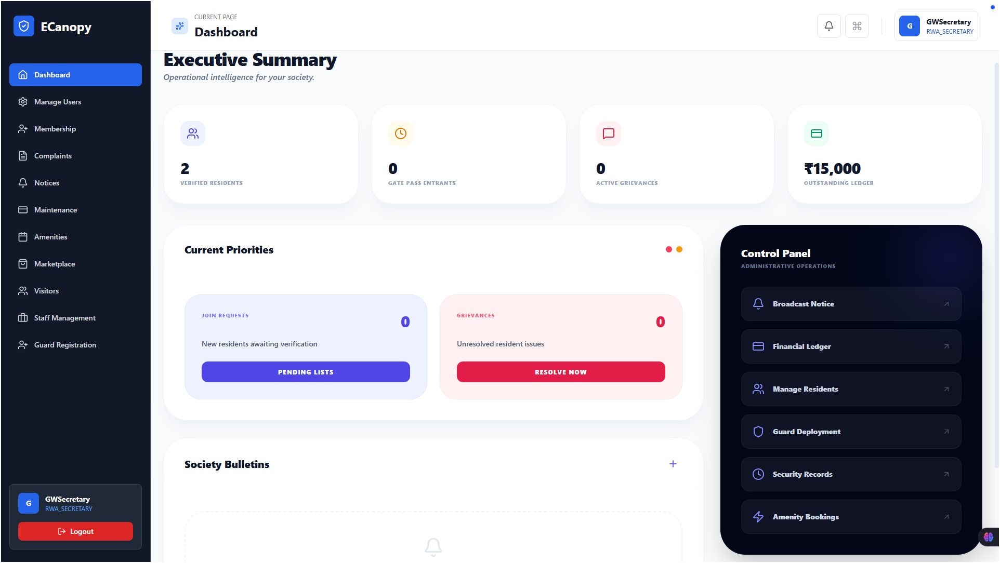 |

| Manage Users | Manage Amenities |
|-----------|-----------|
| 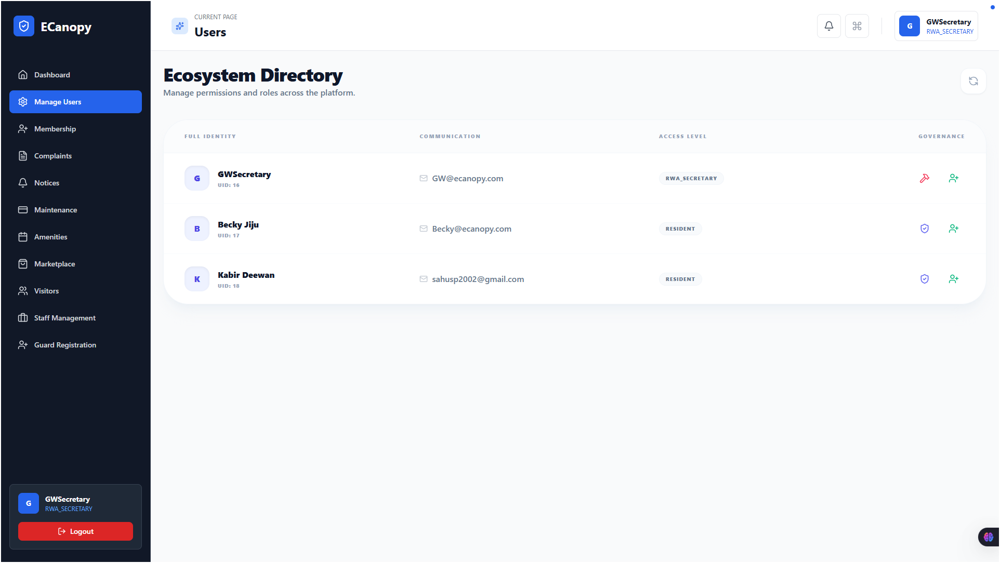 |  |

| Add Amenities | Amenities Approval |
|-----------|-----------|
| 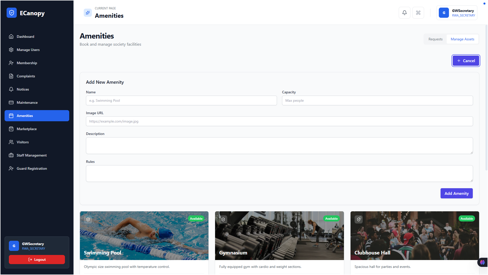 |  |

| Maintenance Billing | Society Grievance |
|-----------|-----------|
| 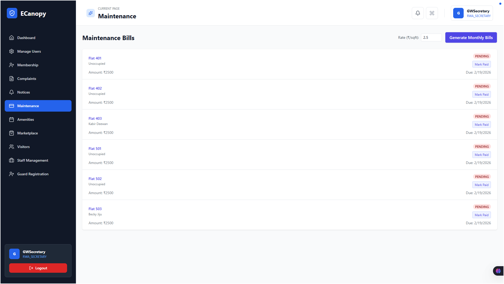 |  |

| Resident Onboarding | Security Onboarding |
|------|-----------|
|  |  |

---

### 🧑‍💼 Resident Panel
> Residents can book amenities, raise complaints, pay maintenance, and use marketplace features.

| Login | Dashboard |
|-----------|-----------|
| 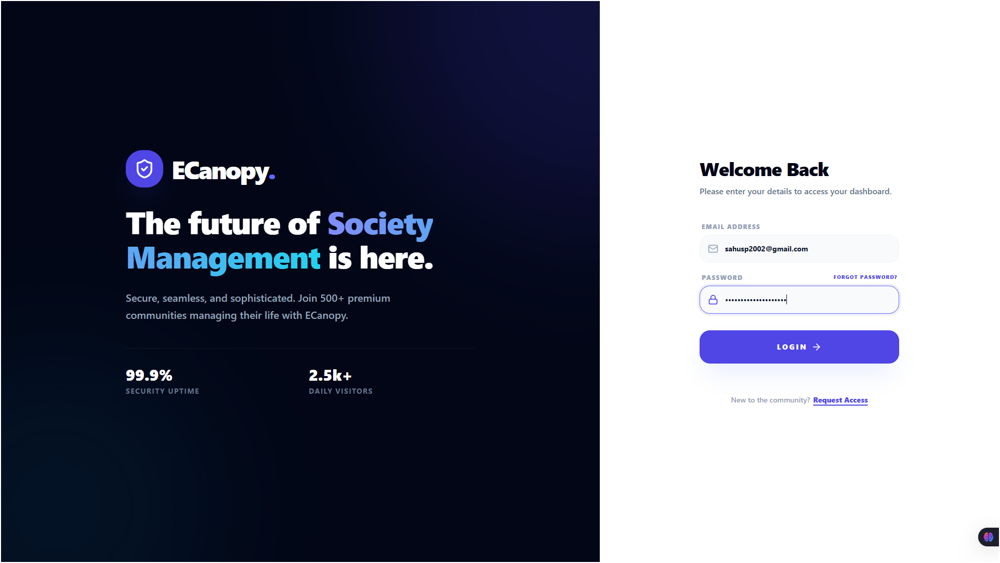 |  |

| Amenities | Booking Page |
|-----------|-----------|
|  |  |

| Booked / Pending | Maintenance Billing |
|------|-----------|
|  | 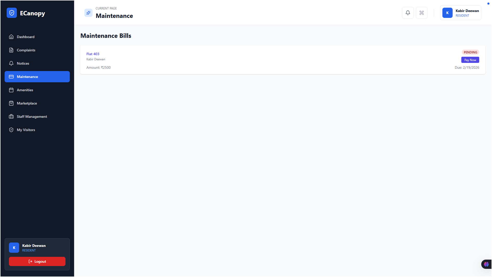 |

| Complaint Logger | Complaint Page |
|------|-----------|
|  |  |

| Marketplace | Email Confirmation |
|------|-----------|
|  | 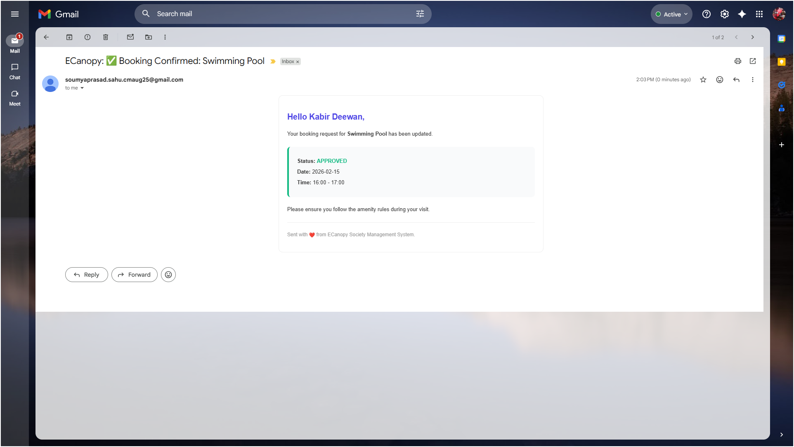 |

---

### 📄 API Docs (Swagger)
> Full REST API documented with Swagger UI.

|  |  |
|---|---|
|  |  |
| 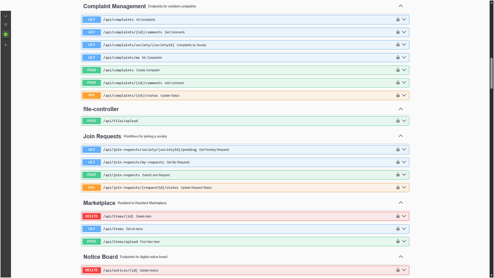 |  |
|  |  |
| 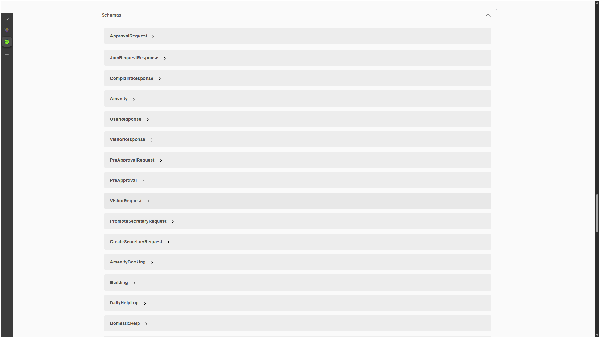 |  |
|  |  |

---

## 🚀 Key Highlights

✅ **Role-Based Panels (RBAC)**
- 🛡️ Super Admin Panel
- 🧑‍💼 Secretary / RWA Panel
- 🧑 Resident Panel
- 🛡️ Security Guard Panel (Visitor Flow)

✅ **JWT Authentication + Spring Security**  
✅ **Swagger OpenAPI Documentation**  
✅ **Amenity Booking Approval Workflow**  
✅ **Razorpay Payment Gateway Integration**  
✅ **Gmail SMTP Email Notifications**  
✅ **MySQL + JPA (21 Entities, 12 Enums)**  
✅ **Complaint Ticketing + Attachments + Comments**

---

## 🧑‍💻 Tech Stack

### Backend
- **Java 17 (LTS)**
- **Spring Boot 3.2.2**
- **Spring Security 6.2.1**
- **JWT (jjwt 0.12.3)**
- **Spring Data JPA / Hibernate**
- **MySQL 8.0+**
- **SpringDoc OpenAPI (Swagger)**
- **Spring Mail (Gmail SMTP)**
- **Razorpay Java SDK**
- **Lombok**

### Frontend
- **React**
- Role-based UI dashboards
- Forms + models + workflow pages

---

## 🏗️ Architecture

This project follows a clean **Layered Architecture**:

Controller Layer (REST API) <br>
&nbsp;&nbsp;&nbsp;&nbsp;&nbsp;&nbsp;&nbsp;&nbsp;&nbsp;&nbsp;↓ <br>
DTO Layer (Request/Response Mapping) <br>
&nbsp;&nbsp;&nbsp;&nbsp;&nbsp;&nbsp;&nbsp;&nbsp;&nbsp;&nbsp;↓ <br>
Service Layer (Business Logic) <br>
&nbsp;&nbsp;&nbsp;&nbsp;&nbsp;&nbsp;&nbsp;&nbsp;&nbsp;&nbsp;↓ <br>
Repository Layer (JPA + Queries) <br>
&nbsp;&nbsp;&nbsp;&nbsp;&nbsp;&nbsp;&nbsp;&nbsp;&nbsp;&nbsp;↓ <br>
Database Layer (MySQL)

---

## 🔐 Role-Based Access Control (RBAC)

| Role | Responsibilities |
|------|------------------|
| **SUPER_ADMIN** | Full system access, Society Onboarding, Manage buildings, Flats |
| **RWA_SECRETARY** | Manage Residents Onboarding, Approve and Manage amenities, Handle complaints, Manage Notices |
| **SECURITY_GUARD** | Visitor logs and Approvals workflow |
| **RESIDENT** | Book amenities, Raise Complaints, Pay Bills, Buy and Sell Marketplace |

---

## 📦 Modules Implemented

### 🏢 Society & Resident Management
- Create societies
- Add buildings, flats
- Resident onboarding workflow (join requests)

### 🏊 Amenities Booking (Approval Workflow)
- Resident books amenity
- Secretary approves/rejects
- Resident receives email notification
- Overlap detection to prevent double booking

### 👥 Visitor Management
- Guard logs visitor
- Resident approval workflow
- Visitor check-in / check-out

### 🎫 Complaints & Helpdesk
- Raise complaint
- Chat/comments on complaint → `PENDING`
- Attachments upload → `PENDING`
- Status updates

### 💰 Maintenance Billing + Razorpay Payments
- Bill generation
- Online payment integration → `PENDING`
- Payment verification → `PENDING`

### 📢 Notice Board
- Society announcements
- Categorized notices → `PENDING`

### 🛒 Marketplace
- Resident buy/sell listing feature → `PENDING`

---

## 📑 Swagger API Documentation

Once backend is running, Swagger is available at:

http://localhost:8080/swagger-ui.html

---

## ⚙️ Setup Instructions (Backend)

### ✅ Prerequisites
- Java 17+
- Maven 3.6+
- MySQL 8.0+

---

### 1️⃣ Clone Repository
```bash
git clone <your-repo-url>
cd ecanopy
```

### 2️⃣ Create MySQL Database
```
CREATE DATABASE ecanopy_master_db;
```

### 3️⃣ Configure Environment Variables
### Database
```
DB_PASSWORD=your_mysql_password
```
### JWT
```
JWT_SECRET=your_jwt_secret_key
```
### Gmail SMTP
```
SMTP_USERNAME=your_email@gmail.com
SMTP_PASSWORD=your_gmail_app_password
```

### Razorpay
```
RAZORPAY_KEY_ID=rzp_test_your_key
RAZORPAY_KEY_SECRET=your_secret_key
```

### 4️⃣ Run Backend
```
mvn clean install
mvn spring-boot:run
```

### ⚙️ Setup Instructions (Frontend)
```
cd frontend
npm install
npm run dev
npm run dev
```
----
